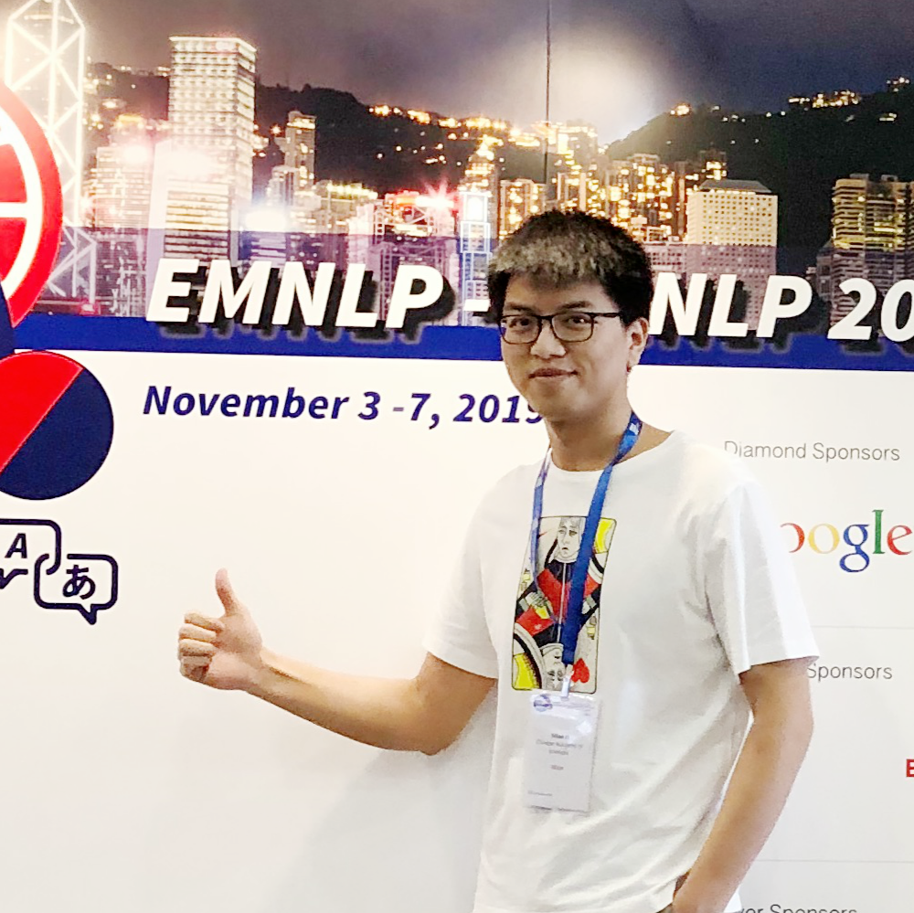

<table>
<tr>
<td width="310" align="center">
    

      
    

</td>
<td>
     <b>Miao LI (李淼)</b>
    

        
        
 Third-year master student 

        <a href="http://lcs.ios.ac.cn/en/wiki/Main_Page">State Key Laboratory of Computer Science</a>,  
        <a href="http://english.is.cas.cn/">Institute of Software Chinese Academy of Sciences</a> 
		    <a href="http://english.ucas.ac.cn/">University of Chinese Academy of Sciences</a> 
        Phone: (+86) 188-1070-7818  
        Email: miaoli DOT cs AT gmail DOT com 
        Address: 4# South Fourth Street, ZhongGuanCun, Beijing, China 
        
   

</td>
</tr>
</table>

*The supreme happiness of life is the conviction that we are loved.             ------ Victor Hugo*

#### Brief Bio

I'm currently a third-year master student (exam-exempted postgraduate) at School of Computer Science and Technology, University of Chinese Academy of Sciences ([UCAS](https://english.ucas.ac.cn/)), now studying at the Institute of Software, Chinese Academy of Sciences ([ISCAS](http://english.is.cas.cn/)), supervised by [Prof. Beihong Jin](http://work.iscas.ac.cn/index.php/Jinbeihong/index/beihong.html), and  I'm going to graduate in June 2020. Prior to ISCAS, I obtained my Bachelor's degree in School of Software, Northeastern University ([NEU](http://english.neu.edu.cn/)) in 2017. More information about me is [here](https://oaimli.github.io/files/CV_MiaoLi.pdf).

#### Research Interests

My research interests fall in developing machine learning models for natural language processing and text mining. I always desire that machines can understand and generate texts like human beings. 

My current research has been focusing on:

- Deep unsupervised learning for text processing
- Text generation and document-level understanding
- Knowledge guided natural language processing
- Model transparency, interpretability, and controllability
- Deep latent-variable models for text clustering (master thesis) 

#### Technical Skills

- Skilled programming in Python, Java, and LaTeX, also familiar with Linux 
- Proficient in deep learning programming, especially in Keras and Tensorflow, and programming tool boxes (e.g. Numpy, Scipy, Scikit-learn, NLTK)
- Master at most Machine Learning Models (e.g. SVM, LDA, CRF) and inference methods (e.g. Variational Inference and Monte Carlo Method)
- Understand deep learning well, such as CNN, RNN and high-level deep generative models, especially Variational Auto-Encoder
- Familiar with fundamental tasks and models of Natural Language Processing and Text Mining, like text modeling, information extraction, text generation, etc.

#### Selected Publications

- Hongyin Tang, ***Miao Li***, Beihong Jin. A Topic Augmented Text Generation Model: Joint Learning of Semantics and Structural features (EMNLP 2019, CCF Rank B), [PDF](https://www.aclweb.org/anthology/D19-1513/), [appendix](https://oaimli.github.io/files/paper_at_emnlp2019_appendix.pdf)
- ***Miao Li***,  Hongyin Tang, Beihong Jin, Chengqing Zong. A New Effective Neural Variational Model with Mixture-of-Gaussians Prior for Text Clustering (ICTAI 2019, CCF Rank C), [PDF](https://oaimli.github.io/files/paper_at_ictai2019.pdf) 
- ***Miao Li***, Hongyin Tang, Beihong Jin. Clustering Large-Scale Origin-Destination Pairs: A Case Study for Public Transit in Beijing (UIC 2018, CCF Rank C), [PDF](https://ieeexplore.ieee.org/document/8560115) 
- Software copyright of a medical system in Android, No.2016SR133938, June 2016, [PDF](https://oaimli.github.io/files/software_copyright.pdf)

#### Projects

#### Honors and Awards

- National Scholarship for Graduates, Education Ministry of China, November 2018
- The First Prize Scholarship, University of Chinese Academy of Sciences, October 2018
- Excellent Student Cadre, University of Chinese Academy of Sciences, twice on June 2018&2019
- Merit Student, University of Chinese Academy of Sciences, twice on June 2018&2019
- Outstanding Graduate, Northeastern University, June 2017
- Outstanding graduate thesis Award, Northeastern University, July 2017
- The First prize scholarship, Northeastern University, twice on September 2015&2016
- National Encouragement Scholarship, Education Ministry of China, twice on October 2015&2016
- Excellent Student Cadre, Northeastern University, twice on October 2015&2016
- Merit Student, Northeastern University, three times on October 2014-2016

#### Other Experiences

- Volunteer in the 12th Chinese National Game, September 2013

Note: please watch my notes about machine learning, natural language processing and text mining at [Zhihu](https://www.zhihu.com/people/oaimli/posts), and follow my WeChat Official Account TextAI.

