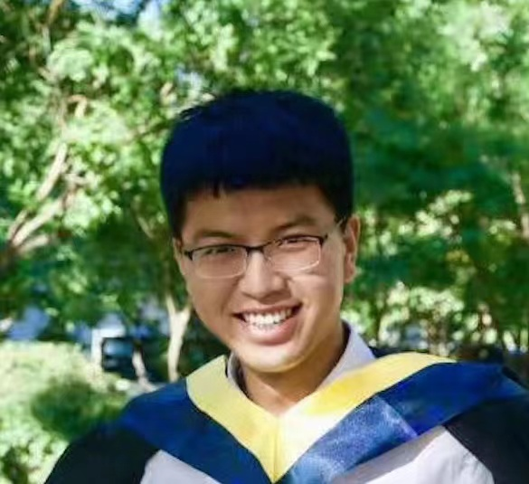

<table>
<tr>
<td width="260" align="center">
    

      
    

</td>
<td>
    

        
        <b>Miao Li</b> (/ˈmja.o/ /liː/) 
        PhD Candidate in NLP/AI 
        <a href="https://cis.unimelb.edu.au/">School of Computing and Information Systems</a>,  
        <a href="https://www.unimelb.edu.au/">The University of Melbourne</a> 
        Email (preferred): prefix.cs@gmail.com, prefix->miaoli 
        Email (university): prefix@student.unimelb.edu.au, prefix->miao4 
        Address: Informatics Forum, 10 Crichton Street, Edinburgh, Scotland EH8 9AB
        
   

</td>
</tr>
</table>

*The supreme happiness of life is the conviction that we are loved.  &emsp;--- Victor Hugo*

### Brief Bio

Miao is currently a PhD candidate at School of Computing and Information Systems, The University of Melbourne ([UoM](https://www.unimelb.edu.au/)), advised equally by [Prof. Eduard Hovy](https://scholar.google.com/citations?user=PUFxrroAAAAJ&hl=en) (UoM and [CMU](https://lti.cs.cmu.edu/)) and [Dr. Jey Han Lau](https://scholar.google.com.au/citations?user=MFi65f4AAAAJ&hl=en&oi=ao) (UoM) within [Natural Language Processing Group](https://cis.unimelb.edu.au/research/artificial-intelligence/research/Natural-Language-Processing). He has been doing visiting research under the supervision of [Prof. Mirella Lapata](https://scholar.google.com.au/citations?user=j67B9Q4AAAAJ&hl=en) at [ILCC](https://web.inf.ed.ac.uk/ilcc), [The University of Edinburgh](https://www.ed.ac.uk/) since March 2024. His PhD journey at UoM started in December 2020. Before PhD, after obtaining a B.E. from Northeastern University in 2017, he studied as an exam-exempted master's student at State Key Laboratory of Computer Science, China and completed his M.Sc. in July 2020 from Chinese Academy of Sciences. 

### Research Interests

Miao is interested in natural language processing (NLP) which aims to enable computers to understand, reason with, and generate natural language. Throughout the years of pursuing the PhD, his primary area of interest revolves around **multi-document language generation**, which requires computational models to possess information selection and reasoning capabilities over multiple source documents. Miao's PhD research aims to investigate multi-document language generation from the perspective of **information consolidation** and **complex reasoning** and make the generation process less opaque and more grounded. In the long term, Miao's overarching research goal is to (1) understand how humans comprehend multi-source information with reasoning to make their decisions in language production from first principles, (2) explore the potential of computers to achieve superhuman-level information consolidation and reasoning over **multiple sources with voluminous and complex heterogeneous information** and realize human-like communication conveying information based on devised consequences from them, and (3) develop high-quality evaluations on not only output generations but also inner workings of artificial intelligence systems for complex natural language generation tasks. 

### Selected Publications

- A Sentiment Consolidation Framework for Meta-Review Generation. [PDF](https://arxiv.org/abs/2402.18005)   ***Miao Li***, Jey Han Lau, and Eduard Hovy.   ACL 2024.
- NewsBench: A Systematic Evaluation Framework for Assessing Editorial Capabilities of Large Language Models in Chinese Journalism. [PDF](https://arxiv.org/abs/2403.00862)   ***Miao Li***, Ming-Bin Chen, Bo Tang, Shengbin Hou, Pengyu Wang, Haiying Deng, Zhiyu Li, Feiyu Xiong, Keming Mao, Peng Cheng, and Yi Luo.   ACL 2024.
- Summarizing Multiple Documents with Conversational Structure for Meta-Review Generation. [PDF](https://arxiv.org/abs/2305.01498)   ***Miao Li***, Eduard Hovy, and Jey Han Lau.   EMNLP 2023.
- DeltaScore: Fine-grained Story Evaluation with Perturbations. [PDF](https://arxiv.org/abs/2303.08991)   Zhuohan Xie, ***Miao Li***, Trevor Cohn, and Jey Han Lau.   EMNLP 2023.
- Compressed Heterogeneous Graph for Abstractive Multi-Document Summarization. Oral. [PDF](https://arxiv.org/abs/2303.06565)   ***Miao Li***, Jianzhong Qi, and Jey Han Lau.   AAAI 2023.
- Personalized Abstractive Opinion Tagging. Oral. [PDF](https://dl.acm.org/doi/10.1145/3477495.3532037)   Mengxue Zhao, Yang Yang, ***Miao Li***, Jingang Wang, Wei Wu, Pengjie Ren, Maarten de Rijke and Zhaochun Ren.   SIGIR 2022.
- A Benchmark and Comprehensive Survey on Knowledge Graph Entity Alignment via Representation Learning. [PDF](https://link.springer.com/article/10.1007/s00778-022-00747-z)   Rui Zhang, Bayu Distiawan Trisedy, ***Miao Li***, Yong Jiang, Jianzhong Qi.   VLDB Journal 2022.
- A Topic Augmented Text Generation Model: Joint Learning of Semantics and Structural Features. Oral. [PDF](https://www.aclweb.org/anthology/D19-1513/) / [Appendix](https://oaimli.github.io/files/paper_at_emnlp2019_appendix.pdf)   Hongyin Tang, ***Miao Li***, Beihong Jin.   EMNLP 2019.
- A New Effective Neural Variational Model with Mixture-of-Gaussians Prior for Text Clustering. Oral. [PDF](https://oaimli.github.io/files/paper_at_ictai2019.pdf)   ***Miao Li***,  Hongyin Tang, Beihong Jin, Chengqing Zong.   ICTAI 2019.
- Clustering Large-Scale Origin-Destination Pairs: A Case Study for Public Transit in Beijing. Oral. [PDF](https://ieeexplore.ieee.org/document/8560115)   ***Miao Li***, Hongyin Tang, Beihong Jin.   UIC 2018.

### Honors and Awards

- AAAI-23 Student Scholarship, Association for the Advancement of Artificial Intelligence, January 2023
- Google Conference Scholarship, Google Inc., January 2023
- Excellent Student Cadre, University of Chinese Academy of Sciences, June 2019
- National Scholarship for Graduates, Education Ministry of China, November 2018
- The First Prize Scholarship, University of Chinese Academy of Sciences, October 2018
- Excellent Student Cadre, University of Chinese Academy of Sciences, June 2018
- Outstanding Graduate, Northeastern University, June 2017
- Outstanding Graduate Thesis Award, Northeastern University, July 2017
- The First Prize Scholarship, Northeastern University, September 2016
- National Scholarship for Undergraduates, Education Ministry of China, October 2016
- The First Prize Scholarship, Northeastern University, September 2015
- National Scholarship for Undergraduates, Education Ministry of China, October 2015
- Excellent Student Cadre, Northeastern University, October 2015

### Professional Services

- Reviewer for ACL Rolling Review (2021 - Present)
- Member of reviewer committees: NLPCC 2022-2023, EACL 2023, ACL 2023, EMNLP 2023
- Subreviewer for WSDM 2022, SIGIR 2022, SIGKDD 2022, and CIKM 2022

